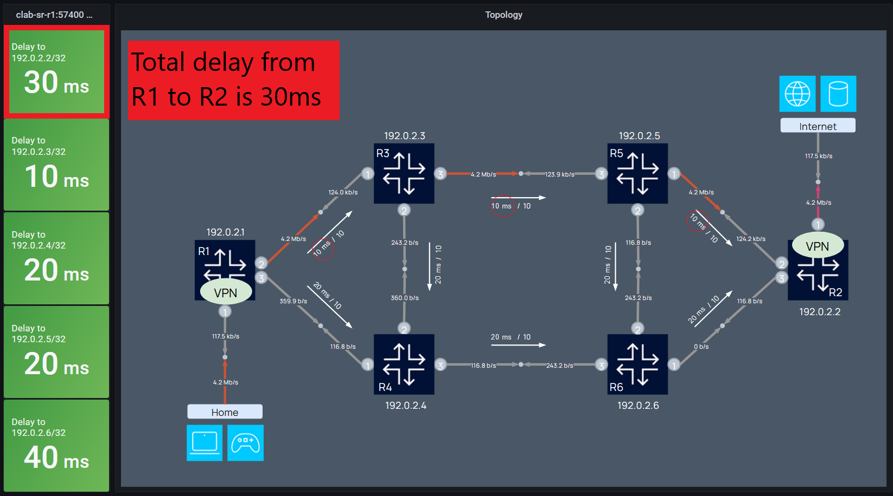

# SROS SR-MPLS: low latency service with Flex-Algo

Flexible-Algorithm (Flex-Algo) provides a mechanism for IGPs to compute constraint-based paths across a network. We use a Flexible-Algorithm Definition (FAD) to describe how a particular algorithm should look like by defining what metric-type needs to be used when calculating the shortest path. This metric type can be IGP-metric, TE-metric or delay-metric. In this lab we will be using delay-metric to provide a low-latency service. The **goal** of this lab is to show case that per VPN service we can provide one prefix to use delay-metric and another prefix to use standard IGP-metric to calculate the shortest path. All done with Segment Routing and MPLS in the underlay.

This is translated into a home user that has access to two services. One service is a low-latency service when gaming while connected to the gaming servers. The other is using standard IGP metric when the user is making use of the internet service.

This lab also comes with a GPG telemetry stack (gNMIc Prometheus Grafan) to easily monitor how traffic is behaving in the network.


## Deploying the lab

The lab is deployed with [containerlab](https://containerlab.dev/) project where [`nokia-sr.clab.yml`](https://github.com/srl-labs/nokia-segment-routing-lab/blob/master/nokia-sr.clab.yml) file declaratively describes the lab topology.

```
clab deploy
```

Same goes for destroying the lab

```
clab destroy
```

## Accessing the network elements

After deploying the lab, you will see a summary of the deployed nodes in table format like below. To access a network element with SSH simply use the hostname as described in the table.

```
ssh admin@clab-sr-r1
```

The Linux CE clients can be accessed as regular containers, you can connect to them just like to any other container

```
docker exec -it clab-sr-client1 bash
```

## Configuration

All nodes come preconfigured thanks to startup-config setting in the topology file [`nokia-sr.clab.yml`](nokia-sr.clab.yml), so there is no need to configure the nodes after deployment. Each node has its own config file which you can find [`configs`](/configs).

This is the high-level overview to enable Flex-Algo for SR-MPLS:

1. Configure and advertise the Flex-Algo Definition (FAD)
2. Configure Flex-Algo participation
3. Configure a Flex-Algo prefix node-SID on all routers that will use Flex-Algo
4. Apply traffic steering with Flex-Algo on VPN service

### 1. Configure and advertise FAD

Create the FAD with metric-type delay and advertise it into the IGP. In our case we are using ISIS

```
A:admin@R1# admin show configuration /configure routing-options
    flexible-algorithm-definitions {
        flex-algo "Flex-Algo-128" {
            admin-state enable
            description "Flex-Algo for Delay Metric"
            metric-type delay
        }
    }
```

Next enable Flex-Algo under ISIS. Only one router in the domain needs to advertise the FAD but everyone who wants to be part of the Flex-Algo topology needs to participate. In our case only R1 is advertising the FAD and all other routers are participating.

```
A:admin@R1# admin show configuration /configure router isis flexible-algorithms
    admin-state enable
    flex-algo 128 {
        participate true
        advertise "Flex-Algo-128"
    }

```

We can see R1 is advertising the FAD as an ISIS Sub-Tlv with metric-type delay. All participating routers now know how the Flex-Algo looks like.

<pre>
A:admin@R1# show router isis database R1.00-00 level 2 detail | match "FAD Sub-Tlv" post-lines 5
    FAD Sub-Tlv:
        Flex-Algorithm   : 128
        <b>Metric-Type      : delay</b>
        Calculation-Type : 0
        Priority         : 100
        Flags: M
</pre>

### 2. Configure Flex-Algo participation

Looking into R3 we can see its only participating in the Flex-Algo topology and not advertising the FAD.

```
A:admin@R3# admin show configuration /configure router isis flexible-algorithms
    admin-state enable
    flex-algo 128 {
        participate true
    }
```

If we investigate the Router Capabilities Tlv of R3 we can see its supporting two SR Algo's, the default SFP algorithm based on IGP-metric and Flex-Algo 128 based on delay-metric

<pre>
A:admin@R3# show router isis database R3.00-00 level 2 detail | match "Router Cap" post-lines 5
  Router Cap : 192.0.2.3, D:0, S:0
    TE Node Cap : B E M  P
    SR Cap: IPv4 MPLS-IPv6
       SRGB Base:100000, Range:1000
    <b>SR Alg: metric based SPF, 128</b>
    Node MSD Cap: BMI : 12 ERLD : 15
</pre>

### 3. Configure a Flex-Algo prefix node-SID on all router that will use Flex-Algo

Assign a prefix node-SID for Segment Routing with Flex-Algo and a prefix node-SID for default Segment Routing.

```
A:admin@R1# admin show configuration /configure router isis interface "system"
    ipv4-node-sid {
        index 1
    }
    flex-algo 128 
        ipv4-node-sid {
            index 11
        }
    }
```

We can see R1 is advertising into ISIS a Prefix-SID with index 1 for Algo-0, which is the default IGP-based algo, and a Prefix-SID with index 11 for Algo-128 which is our Flex-Algo.

```
A:admin@R1# show router isis database R1.00-00 level 2 detail | match "TE IP Reach" post-lines 12
  TE IP Reach   :
<snipp>
    Prefix   : 192.0.2.1
    Sub TLV   :
      Prefix-SID Index:1, Algo:0, Flags:NnP
      Prefix-SID Index:11, Algo:128, Flags:NnP
```

### 4. Apply traffic steering with Flex-Algo on VPN service

In the bgp-ipvpn context of our VPN we define Segment Routing as our tunnel between services, which means we use SPF Segment Routing but not necessarily Flex-Algo. For that we need to define an import policy `customer1-import` to define which prefix will be using Flex-Algo.

```
A:admin@R1# admin show configuration /configure service vprn "customer1"
    admin-state enable
    service-id 1
    customer "1"
    bgp-ipvpn {
        mpls {
            admin-state enable
            route-distinguisher "1:1"
            vrf-target {
                community "target:65000:1"
            }
            vrf-import {
                policy ["customer1-import"]
            }
            auto-bind-tunnel {
                resolution filter
                allow-flex-algo-fallback true
                resolution-filter {
                    sr-isis true
                }
```

In our `customer1-import` policy `entry 20` we can see we accept gaming specific routes to use Flex-Algo while in `entry 10` we accept internet specific prefixes to use regular Segment Routing based on IGP-metric.

```
A:admin@R1# admin show configuration /configure policy-options policy-statement "customer1-import"
    entry 10 {
        from {
            prefix-list ["internet"]
            community {
                name "customer1-import"
            }
        }
        action {
            action-type accept
        }
    }
    entry 20 {
        from {
            prefix-list ["gaming"]
            community {
                name "customer1-import"
            }
        }
        action {
            action-type accept
            flex-algo 128
        }
    }
    default-action {
        action-type reject
    }

```

```
A:admin@R1# show router 1 route-table

===============================================================================
Route Table (Service: 1)
===============================================================================
Dest Prefix[Flags]                            Type    Proto     Age        Pref
      Next Hop[Interface Name]                                    Metric
-------------------------------------------------------------------------------
10.0.1.0/24                                   Local   Local     02h37m23s  0
       to_client1                                                   0
10.0.2.0/24                                   Remote  BGP VPN   02h35m59s  170
       192.0.2.2 (tunneled:SR-ISIS:524296)                          30
20.0.1.0/24                                   Local   Local     02h37m23s  0
       to_gamer1                                                    0
20.0.2.0/24                                   Remote  BGP VPN   00h41m02s  170
       192.0.2.2 (tunneled:SR-ISIS:524300)                          60000
```

### Verify that link delays are advertised into ISIS

The upper plane (R1->R3->R5-R2) configured statically with a 10ms delay. While to lower plane (R1->R4->R6->R2) is configured with 20ms. We can see R1 is advertising a delay of 10ms for its link towards R3. Now all routers are aware how much delay is on each interface in our ISIS area.

<pre>
A:admin@R1# show router isis database R1.00-00 detail
<snipp>
  TE IS Nbrs   :
    Nbr   : R3.00
    Default Metric  : 10
    Sub TLV Len     : 34
    IF Addr   : 192.168.13.0
    Nbr IP    : 192.168.13.1
    TE APP LINK ATTR    :
      SABML-flag:Non-Legacy SABM-flags:   X
        <b>Delay Min : 10000 Max : 10000</b>
    Adj-SID: Flags:v4VL Weight:0 Label:524285
</pre>

## Running traffic

To run traffic between the home user and the internet services, leverage `traffic.sh` control script.

To start the traffic from home users to internet service or gaming service:

* `bash traffic.sh start internet` - start traffic from home user to internet service
* `bash traffic.sh start gamer` - start traffic from gamer to low-latency gaming service

To stop the traffic:

* `bash traffic.sh stop` - stop traffic generation between all nodes

### 1. Home user starts surfing on the internet

The traffic path to the internet services follows the default ISIS IGP-metric which is 10.


### 2. Gamer starts gaming

The gamer requires a low-latency service and traffic is following the upper plane which has a total latency of 30ms from R1 to R2.



### 3. Adding latency

By increasing the latency on the link between R3 and R5 to 60ms, we can see traffic shifting to the lower plane. The upper plane has a total delay of 80ms while to lower plane has now a total delay of 60ms. Note that the traffic for the internet user remains the same.


## Access details

* Grafana: <http://localhost:3000>
* Prometheus: <http://localhost:9090/graph>
